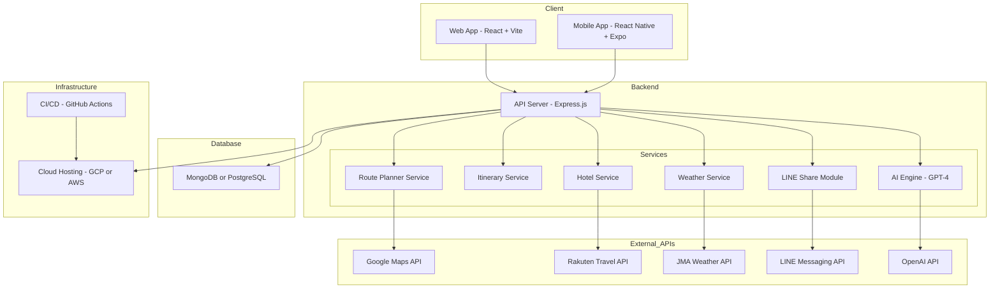

# Japan Travel Planner AI

Japan Travel Planner AI is an AI-powered, full-stack web and mobile application built with React, Node.js, Express, MongoDB, and React Native. The project brings together real-time travel data from multiple sources: Hyperdia (transportation), Rakuten Travel (accommodation), the Japan Meteorological Agency (weather), Google Maps (navigation), LINE (communication), and OpenAI's ChatGPT for AI-driven recommendations. The backend is deployed on Google Cloud and automated with GitHub Actions for CI/CD. Both the web and mobile apps are optimized for a responsive, modern user experience using Material UI and React Native Paper.

---

## Key Features

- **AI Itinerary Generator:** Get a custom day-by-day plan based on your interests, pace, and destinations.
- **Transit Guidance:** Find routes, train times, and bus options in real time (Google Maps).
- **Weather at a Glance:** Accurate daily forecasts (JMA) keep your plans flexible.
- **Hotel Suggestions:** Hotel recommendations integrated directly from Rakuten Travel.
- **Interactive Maps:** See your full trip visually—daily pins and detailed routes.
- **Save & Share:** Keep your itineraries in the cloud or on your device; share them easily.
- **Personalization:** Edit, add, or remove activities to truly make the plan your own.
- **Cross-Platform:** Works on both web and mobile for a seamless experience anywhere.

---

## Technology Stack

| Component                | Technologies Used                              |
| ------------------------ | ---------------------------------------------- |
| **Frontend**             | React, Vite (Web); React Native, Expo (Mobile) |
| **Backend**              | Node.js, Express.js                            |
| **Database**             | MongoDB or PostgreSQL                          |
| **AI Integration**       | OpenAI API                                     |
| **Maps & Directions**    | Google Maps API                                |
| **Accommodation**        | Rakuten Travel API                             |
| **Weather Data**         | JMA or OpenWeatherMap                          |
| **Hosting & Deployment** | Google Cloud, Vercel, Render, Expo Go          |
| **CI/CD**                | GitHub Actions                                 |

---

## Getting Started

### Clone the Repository

```bash
git clone https://github.com/CodeByYuxuan/japan-travel-planner-ai.git
cd japan-travel-planner-ai
```

### Set up your environment

Create `.env` files using the provided `.env.example`:

```
OPENAI_API_KEY=your_openai_key
GOOGLE_MAPS_API_KEY=your_google_maps_key
RAKUTEN_API_KEY=your_rakuten_key
JMA_API_KEY=your_jma_key
MONGO_URI=your_database_uri
```

### Start each part of the app

**Backend**

```bash
cd server
npm install
npm run dev
```

**Web Frontend**

```bash
cd client-web
npm install
npm run dev
```

**Mobile Application**

```bash
cd client-mobile
npm install
npx expo start
```

---

## Deployment

| Component      | Deployment Platforms          |
| -------------- | ----------------------------- |
| **Web App**    | Vercel, Netlify               |
| **Backend**    | Render, Railway, Google Cloud |
| **Database**   | MongoDB Atlas, Supabase       |
| **Mobile App** | Expo Go, EAS Build            |

---

## Architecture Overview

This project is structured with clearly separated web and mobile clients, a Node.js/Express backend, and robust CI/CD pipelines. Real-time data and AI integration help keep the travel plans relevant and personal.



---

## Usage Examples

- "Plan a week in Japan with a focus on food and culture in Tokyo and Kyoto."
- "Find hotels and transit connections automatically."
- "Personalize my trip and share the plan on LINE."

---

## Testing & CI/CD

- **Testing Tools:** Jest, Vitest, React Testing Library, Postman
- **CI/CD:** Automated tests, linting, and deployment via GitHub Actions

---

## Documentation

- [User Stories](docs/user_stories.md)
- [System Architecture](docs/system_architecture.md)
- [Project Plan](docs/project-plan.md)

---

## Future Enhancements

- **AI Chat Assistant** for interactive planning
- **Multilingual UI** (English, Japanese, Chinese)
- **Social Sharing** integration via LINE and direct link
- **PDF Export** of travel itineraries
- **Offline Mode** with cached data
- **AR-Based Navigation** for enhanced user experience (stretch goal)

---

## Contribution Guidelines

Contributions are welcome—whether it is new features, bug fixes, or feedback.

1. Fork this repository.
2. Create your feature branch (`git checkout -b feature/new-feature`).
3. Commit your changes (`git commit -m 'Add new feature'`).
4. Push to the branch (`git push origin feature/new-feature`).
5. Open a pull request and clearly describe your changes.

---

## Developer Information

**Yuxuan LIU**
</br>
Email: [liuyuxuan0611@gmail.com](mailto:liuyuxuan0611@gmail.com)
</br>
LinkedIn: [https://www.linkedin.com/in/yuxuan-liu-rick/](https://www.linkedin.com/in/yuxuan-liu-rick/)
</br>
GitHub: [https://github.com/CodeByYuxuan](https://github.com/CodeByYuxuan)

---

## License

MIT License (see LICENSE for details).

## Troubleshooting

### MongoDB Connection Error

- Ensure MongoDB is running locally (`mongod`) or that your connection string from MongoDB Atlas is correctly configured in `.env`.
- Use the following to test your connection:

```bash
mongo <your-database-uri>
```

- Make sure your IP address is added to the Atlas access list if using Atlas.

### Backend Not Starting

- Confirm `.env` is present and contains valid values.
- Check if ports (e.g., 3001) are already in use.

### CORS or Network Errors

- Make sure your backend includes CORS middleware:

```js
const cors = require("cors");
app.use(cors());
```

---

## Local Database Setup (MongoDB)

To use MongoDB locally:

1. **Install MongoDB Community Edition:**
   [https://www.mongodb.com/try/download/community](https://www.mongodb.com/try/download/community)

2. **Start MongoDB:**
   Run in terminal:

   ```bash
   mongod
   ```

3. **Update your `.env`:**

   ```
   MONGO_URI=mongodb://localhost:27017/japan-travel-planner
   ```

4. **Connect using MongoDB Compass:** (optional GUI)
   [https://www.mongodb.com/products/compass](https://www.mongodb.com/products/compass)

---
