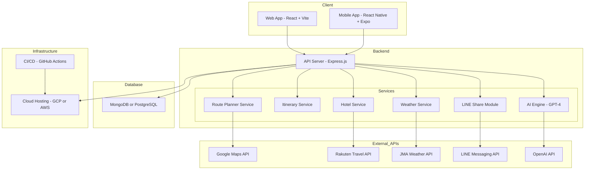

# 🗾 Japan Travel Planner AI

**Japan Travel Planner AI** is a full-stack web and mobile application designed to assist tourists in creating personalized travel itineraries for visits to Japan. Utilizing advanced AI technology, the application seamlessly integrates real-time travel information from trusted sources including OpenAI, Google Maps, Rakuten Travel, and the Japan Meteorological Agency.

---

## ✨ Key Features

- **AI-Powered Itinerary Generator**: Customized daily travel plans based on your destination, dates, interests, and preferred travel pace.
- **Real-Time Transit Guidance**: Comprehensive transportation options powered by Google Maps, including train and bus routes with estimated travel times.
- **Weather Forecasts**: Accurate daily weather updates from the Japan Meteorological Agency to optimize your travel planning.
- **Accommodation Recommendations**: Curated hotel options provided through Rakuten Travel API.
- **Interactive Map Visualization**: Visual overview of your itinerary with daily activity pins and detailed routes.
- **Cloud Save & Share**: Easily save your travel plans to the cloud or your device and share them with friends.
- **User-Friendly Customization**: Adjust, add, or remove activities to personalize your travel plans further.
- **Cross-Platform Experience**: Responsive web application and native mobile app for a consistent user experience.

---

## 🛠 Technology Stack

| Component                | Technologies Used                              |
| ------------------------ | ---------------------------------------------- |
| **Frontend**             | React, Vite (Web); React Native, Expo (Mobile) |
| **Backend**              | Node.js, Express.js                            |
| **Database**             | MongoDB or PostgreSQL                          |
| **AI Integration**       | OpenAI API (GPT-4)                             |
| **Maps & Directions**    | Google Maps API                                |
| **Accommodation**        | Rakuten Travel API                             |
| **Weather Data**         | JMA or OpenWeatherMap                          |
| **Hosting & Deployment** | Vercel, Render, Expo Go                        |

---

## 🚀 Getting Started

### Clone the Repository

```bash
git clone https://github.com/CodeByYuxuan/japan-travel-planner-ai.git
cd japan-travel-planner-ai
```

### Environment Configuration

Create `.env` files using the provided `.env.example`:

```
OPENAI_API_KEY=your_openai_key
GOOGLE_MAPS_API_KEY=your_google_maps_key
RAKUTEN_API_KEY=your_rakuten_key
JMA_API_KEY=your_jma_key
MONGO_URI=your_database_uri
```

### Running the Applications

**Backend**

```bash
cd server
npm install
npm run dev
```

**Web Frontend**

```bash
cd client-web
npm install
npm run dev
```

**Mobile Application**

```bash
cd client-mobile
npm install
npx expo start
```

---

## 🌐 Deployment

| Component      | Deployment Platforms    |
| -------------- | ----------------------- |
| **Web App**    | Vercel, Netlify         |
| **Backend**    | Render, Railway         |
| **Database**   | MongoDB Atlas, Supabase |
| **Mobile App** | Expo Go, EAS Build      |

---

## 📐 Architecture Overview

The project features a structured architecture comprising clearly defined frontend clients, backend services, external integrations, and robust infrastructure with CI/CD pipelines for efficient development and deployment.



---

## 💬 Usage Examples

- "Plan a 7-day cultural and culinary adventure in Tokyo and Kyoto."
- "Automatically suggest hotels and manage transportation details."
- "Personalize my itinerary and easily share it with friends via LINE."

---

## 🧪 Testing & CI/CD

- **Testing Tools:** Jest, Vitest, React Testing Library, Postman
- **Continuous Integration & Deployment:** GitHub Actions for automated testing, linting, and deployment

---

## 📚 Documentation

- [📖 User Stories](docs/user_stories.md)
- [🏗 System Architecture](docs/system_architecture.md)
- [🛣 Project Plan](docs/project-plan.md)

---

## 🚧 Future Enhancements

- **AI Chatbot Assistant** for interactive planning
- **Multilingual Interface** (English, Japanese, Chinese)
- **Social Sharing** integration via LINE and direct link
- **PDF Export** of travel itineraries
- **Offline Mode** with cached data
- **AR-Based Navigation** for enhanced user experience (stretch goal)

---

## 🤝 Contribution Guidelines

We welcome contributions from developers of all skill levels. To contribute:

1. Fork this repository.
2. Create your feature branch (`git checkout -b feature/new-feature`).
3. Commit your changes (`git commit -m 'Add new feature'`).
4. Push to the branch (`git push origin feature/new-feature`).
5. Open a pull request and clearly describe your changes.

---

## 👤 Developer Information

**Yuxuan**
</br>
📧 [liuyuxuan0611@gmail.com](mailto:liuyuxuan0611@gmail.com)
</br>
🔗 [LinkedIn Profile](https://www.linkedin.com/in/yuxuan-liu-rick/)
</br>
🐙 [GitHub Profile](https://github.com/CodeByYuxuan)

---

## 📜 License

This project is licensed under the MIT License - see the [LICENSE](./LICENSE) file for details.
