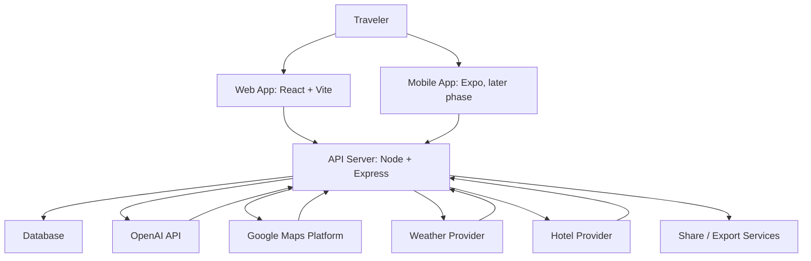

# Japan Travel Planner AI

Japan Travel Planner AI is a planned AI-powered travel planning application for Japan trips. The goal is to turn a traveler's dates, destinations, pace, budget, and interests into an editable day-by-day itinerary enriched with maps, weather, transportation context, accommodation options, and sharing/export tools.

This repository is being rebuilt from an older project README. The original vision included web, mobile, backend, AI recommendations, Google Maps, Rakuten Travel, weather data, LINE sharing, database persistence, and CI/CD. The new plan keeps that ambition but builds it in smaller phases so the product can become usable quickly.

## Current Status

Project phase: scaffolded rebuild.

The current repository contains a minimal TypeScript monorepo skeleton with placeholder web, API, shared, and config packages. Feature work should continue with the web MVP and backend API described in [docs/development_plan.md](docs/development_plan.md).

## Product Goals

- Generate personalized Japan itineraries from natural-language trip preferences.
- Let users edit, reorder, remove, and add activities after generation.
- Enrich each day with practical travel context: maps, route hints, weather, lodging leads, and local notes.
- Save trips for later and share them through links, exports, or messaging integrations.
- Keep the architecture ready for web first, then mobile.

## MVP Scope

The first usable version should focus on a single complete planning loop:

1. A user enters trip dates, cities, interests, travel pace, budget, and constraints.
2. The app generates a structured itinerary with daily activities.
3. The user edits the plan in a web UI.
4. The app saves the trip and can reopen it later.
5. The app adds basic map links and weather context.

Features such as live transit routing, hotel search, LINE sharing, PDF export, offline mode, and the mobile app should follow after the core itinerary loop is stable.

## Planned Features

### Core

- AI itinerary generation with structured JSON output.
- Editable day-by-day itinerary board.
- Trip persistence with user-owned saved plans.
- City, date, budget, pace, and interest-based personalization.
- Activity metadata such as location, estimated time, cost level, category, and notes.

### Travel Enrichment

- Google Maps links and route context.
- Weather summaries from JMA or OpenWeather.
- Accommodation suggestions through Rakuten Travel or another hotel provider.
- Transit recommendations through Google Maps Platform or a Japan-specific routing provider.

### Sharing And Delivery

- Public share links.
- PDF export.
- LINE sharing integration.
- Mobile app through Expo and React Native after the web MVP.

## Proposed Tech Stack

| Area | Proposed Tools |
| --- | --- |
| Web app | React, TypeScript, Vite |
| Mobile app | React Native, Expo |
| Backend API | Node.js, TypeScript, Express |
| Database | PostgreSQL with Prisma, or MongoDB if document-first storage is preferred |
| AI | OpenAI API |
| Maps and routes | Google Maps Platform |
| Weather | JMA or OpenWeather |
| Hotels | Rakuten Travel API or another accommodation provider |
| Testing | Vitest, React Testing Library, Supertest, Playwright |
| CI/CD | GitHub Actions |
| Hosting | Vercel or Netlify for web, Render/Railway/Fly.io/GCP for API, managed database |

## Proposed Repository Structure

```text
japan-travel-planner-ai/
  apps/
    web/                 # React + Vite web client
    api/                 # Express API server
    mobile/              # Expo app, added after web MVP
  packages/
    shared/              # Shared types, schemas, and constants
    config/              # Shared lint, test, and TypeScript config
  docs/
    development_plan.md
  README.md
```

## Planned Environment Variables

```bash
OPENAI_API_KEY=
DATABASE_URL=
GOOGLE_MAPS_API_KEY=
WEATHER_API_KEY=
RAKUTEN_API_KEY=
JWT_SECRET=
WEB_ORIGIN=http://localhost:5173
API_PORT=3001
```

## Local Development

Install dependencies:

```bash
pnpm install
```

Run both local app shells:

```bash
pnpm dev
```

Run quality checks:

```bash
pnpm lint
pnpm typecheck
pnpm test
pnpm build
```

Target app URLs:

- Web: `http://localhost:5173`
- API: `http://localhost:3001`

## Architecture Overview


```mermaid
flowchart TD
    User["Traveler"] --> Web["Web App: React + Vite"]
    User --> Mobile["Mobile App: Expo, later phase"]

    Web --> API["API Server: Node + Express"]
    Mobile --> API

    API --> DB["Database"]
    API --> AI["OpenAI API"]
    API --> Maps["Google Maps Platform"]
    API --> Weather["Weather Provider"]
    API --> Hotels["Hotel Provider"]
    API --> Share["Share / Export Services"]

    AI --> API
    Maps --> API
    Weather --> API
    Hotels --> API
```

## Documentation

- [Development Plan](docs/development_plan.md)

## Development Priorities

1. Scaffold a TypeScript monorepo.
2. Build the web itinerary input and results UI.
3. Add the backend API, validation, and persistence.
4. Implement structured AI itinerary generation.
5. Add maps and weather enrichment.
6. Add sharing/export.
7. Add hotel and transit integrations.
8. Add mobile app support.

## License

MIT License. See [LICENSE](LICENSE).

## Developer

Yuxuan LIU

- Email: [liuyuxuan0611@gmail.com](mailto:liuyuxuan0611@gmail.com)
- LinkedIn: [https://www.linkedin.com/in/yuxuan-liu-rick/](https://www.linkedin.com/in/yuxuan-liu-rick/)
- GitHub: [https://github.com/CodeByYuxuan](https://github.com/CodeByYuxuan)
